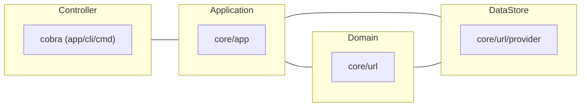
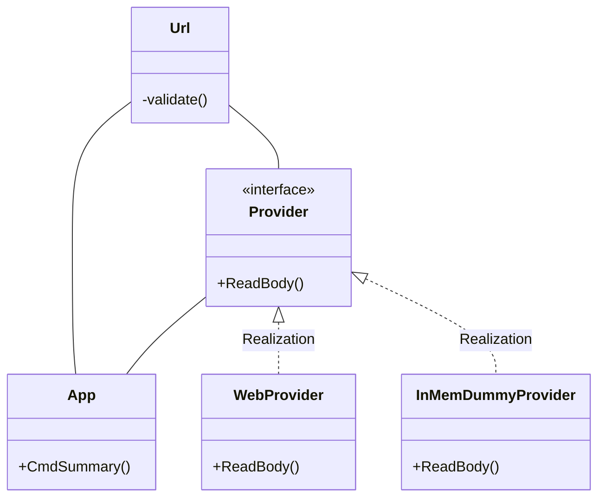

# golang-webfetcher
[](https://github.com/golang/go/releases/tag/go1.18)

The main objective of this repository is to compose a versatile architecture.

It's a simple Cobra CLI application and displays a summary of the target website.

Clean architecture, testing of command lined, switching production or development environments, and abstraction of data sources through dependency injection (DI). It includes the base elements of any project.

This is published as a record of my Golang learning.

## Dependency Module list (Package)

- Modern CLI - [cobra](https://github.com/spf13/cobra)
- Environment Variables - [GoDotEnv](https://github.com/joho/godotenv)
- DI (Dependency Injection) Container - [dig](https://github.com/uber-go/dig)
- Validator - [ozzo-validation](https://github.com/go-ozzo/ozzo-validation)

Detail : go.mod

## Installation

Create go.sum:
```Shell
go mod tidy
```

## Usage

```Shell
go run ./app/cli/main.go summary [Target URL]
```

Response:
```Shell
title : [string]
H1 : [string]
```

## Architecture

Keeping the nature of the Cobra code that exposes the cmd as a variable, adding application logic in a form that is easy to separate.



### Class Diagram (core/)




### Switching easily data stores

The application depends on a data store, but uses a DI container to ease changing. In the case of this program, the data store is the Web, but a database is typically used.

Initialize DI Container ([app/cli/cmd/root.go](https://github.com/skport/golang-webfetcher/blob/b139e9b4ef3555d7007a622e2b364f25ff0e81fa/app/cli/cmd/root.go#L38)):
```go
// Initialize DI container
diContainer = *dig.New()
diContainer.Provide(app.NewApp)

// Register UrlProvider to use with Container
// Switch data source external or dummy
if env == "production" {
  diContainer.Provide(url.NewWebProvider)
  return
}
diContainer.Provide(url.NewInMemDummyProvider)
```

Use Container ([app/cli/cmd/summary.go](https://github.com/skport/golang-webfetcher/blob/b139e9b4ef3555d7007a622e2b364f25ff0e81fa/app/cli/cmd/summary.go#L30)):
```go
// Application Logic
// Create app Instance via DI Container
diContainer.Invoke(
  func(a *app.App) {
    a.CmdSummary(args)
  },
)
```

## Environment

To switch environments, modify the `.env ` file in the root directory as you would in a typical project.
If this element is development, the data source is in-memory. (If production, the data source is web.)

development:
```Shell
APP_ENV=development
```

production:
```Shell
APP_ENV=production
```

If nothing is specified, Switch to development env.

## Testing

```Shell
go test ./app/cli/cmd -v
```

In the `go test` command, the environment is always development. This is because the current directory is the directory to be tested, and therefore the `.env` fails to be retrieved.

## ToDo

- More abstraction
