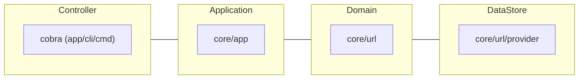

# golang-webfetcher

## About

The main objective of this program is to compose a versatile architecture.

It's a simple program that runs on the command line and displays a summary of the target website.

Clean architecture, testing of command line programs, switching between production and development environments, and abstraction of data sources through dependency injection (DI). It includes the base elements of any project.

This program are published as a record of my Golang learning.

## Dependency module

- Modern CLI
  - [cobra](https://github.com/spf13/cobra)
- Environment Variables
  - [GoDotEnv](https://github.com/joho/godotenv)
- DI (Dependency Injection)
  - [dig](https://github.com/uber-go/digs)
- Validator
  - [ozzo-validation](https://github.com/go-ozzo/ozzo-validation)

Detail : go.mod 

## Architecture



Application depends on a data store, but uses a DI container to ease handling.

Initialize DI Container ([app/cli/cmd/root.go](https://github.com/skport/golang-webfetcher/blob/b139e9b4ef3555d7007a622e2b364f25ff0e81fa/app/cli/cmd/root.go#L38)):
```go
// Initialize DI container
diContainer = *dig.New()
diContainer.Provide(app.NewApp)

// Register UrlProvider to use with Container
// Switch data source external or dummy
if env == "production" {
  diContainer.Provide(url.NewWebProvider)
  return
}
diContainer.Provide(url.NewInMemDummyProvider)
```

Use Container ([app/cli/cmd/summary.go](https://github.com/skport/golang-webfetcher/blob/b139e9b4ef3555d7007a622e2b364f25ff0e81fa/app/cli/cmd/summary.go#L30)):
```go
// Application Logic
// Create app Instance via DI Container
diContainer.Invoke(
  func(a *app.App) {
    a.CmdSummary(args)
  },
)
```

## Environment

To switch environments, modify the `.env ` file in the root directory as you would in a typical project.
If this element is development, the data source is in-memory. (If production, the data source is web.)

development:
```Shell
APP_ENV=development
```

production:
```Shell
APP_ENV=production
```

If nothing is specified, Switch to development env.

## Installation

Create go.sum:
```Shell
go mod tidy
```

## Usage

Basic:
```Shell
go run ./app/cli/main.go summary [Target URL]
```

Response:
```Shell
title : [string]
H1 : [string]
```

## Testing

```Shell
go test ./app/cli/cmd -v
```

## ToDo

- More abstraction